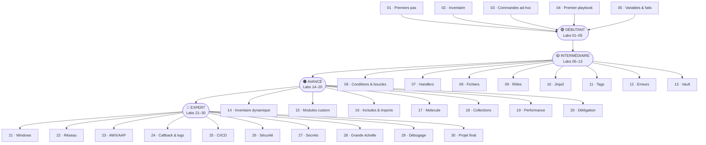

# Série de Labs Ansible – Du Débutant au Professionnel

> Parcours d'apprentissage progressif couvrant **30 labs pratiques** pour maîtriser Ansible, depuis l'installation jusqu'au déploiement en production à grande échelle.

---

## 🚀 Démarrage rapide

Avant de commencer les labs, configurez votre environnement de travail en suivant le guide d'installation :

👉 **[Guide d'installation et de configuration → `setup/README.md`](./setup/README.md)**

---

## 📚 Table des matières – Les 30 Labs

| #  | Titre | Niveau | Concepts clés | Lien |
|----|-------|--------|---------------|------|
| 01 | Premiers pas avec Ansible | 🟢 Débutant | `install check`, `ansible --version`, premier ping | [→ lab-01](./lab-01/) |
| 02 | Gestion de l'inventaire | 🟢 Débutant | INI vs YAML, groupes, host vars | [→ lab-02](./lab-02/) |
| 03 | Commandes ad-hoc | 🟢 Débutant | `shell`, `copy`, `package` | [→ lab-03](./lab-03/) |
| 04 | Premier playbook | �� Débutant | `tasks`, `hosts`, `become` | [→ lab-04](./lab-04/) |
| 05 | Variables & faits | 🟢 Débutant | `vars`, `vars_files`, `gather_facts` | [→ lab-05](./lab-05/) |
| 06 | Conditions & boucles | 🟡 Intermédiaire | `when`, `loop`, `with_items` | [→ lab-06](./lab-06/) |
| 07 | Handlers | 🟡 Intermédiaire | `notify`, `listen`, `flush_handlers` | [→ lab-07](./lab-07/) |
| 08 | Gestion de fichiers | 🟡 Intermédiaire | `copy`, `template`, `file`, `lineinfile` | [→ lab-08](./lab-08/) |
| 09 | Rôles Ansible | 🟡 Intermédiaire | `ansible-galaxy init`, structure, dépendances | [→ lab-09](./lab-09/) |
| 10 | Templates Jinja2 | 🟡 Intermédiaire | filtres, tests, macros | [→ lab-10](./lab-10/) |
| 11 | Tags | 🟡 Intermédiaire | stratégies, `--tags`, `--skip-tags` | [→ lab-11](./lab-11/) |
| 12 | Gestion des erreurs | 🟡 Intermédiaire | `ignore_errors`, `failed_when`, `block/rescue/always` | [→ lab-12](./lab-12/) |
| 13 | Ansible Vault | 🟡 Intermédiaire | `encrypt_string`, fichiers vault | [→ lab-13](./lab-13/) |
| 14 | Inventaire dynamique | 🟠 Avancé | plugins AWS/GCP | [→ lab-14](./lab-14/) |
| 15 | Modules personnalisés | 🟠 Avancé | Python, `AnsibleModule` | [→ lab-15](./lab-15/) |
| 16 | Includes & imports | 🟠 Avancé | `include_tasks`, `import_playbook` | [→ lab-16](./lab-16/) |
| 17 | Tests avec Molecule | 🟠 Avancé | `init`, `converge`, `verify` | [→ lab-17](./lab-17/) |
| 18 | Collections Ansible | 🟠 Avancé | Galaxy, Automation Hub | [→ lab-18](./lab-18/) |
| 19 | Performance & optimisation | 🟠 Avancé | `forks`, `pipelining`, `async/poll` | [→ lab-19](./lab-19/) |
| 20 | Délégation & actions locales | 🟠 Avancé | `delegate_to`, `local_action` | [→ lab-20](./lab-20/) |
| 21 | Gestion Windows | 🔴 Expert | WinRM, modules `win_*` | [→ lab-21](./lab-21/) |
| 22 | Automatisation réseau | 🔴 Expert | `ios_command`, napalm | [→ lab-22](./lab-22/) |
| 23 | AWX / Ansible Automation Platform | 🔴 Expert | job templates, credentials, surveys | [→ lab-23](./lab-23/) |
| 24 | Plugins de callback & logs | 🔴 Expert | custom callback, ARA | [→ lab-24](./lab-24/) |
| 25 | Intégration CI/CD | 🔴 Expert | GitHub Actions, Molecule, ansible-lint | [→ lab-25](./lab-25/) |
| 26 | Durcissement sécurité | 🔴 Expert | least privilege, `no_log`, SELinux | [→ lab-26](./lab-26/) |
| 27 | Gestion des secrets | 🔴 Expert | HashiCorp Vault, CyberArk | [→ lab-27](./lab-27/) |
| 28 | Bonnes pratiques à grande échelle | 🔴 Expert | `serial`, rolling updates | [→ lab-28](./lab-28/) |
| 29 | Dépannage & débogage | 🔴 Expert | `-vvv`, `debugger`, `assert` | [→ lab-29](./lab-29/) |
| 30 | Projet final – App multi-tiers | 🔴 Expert | application multi-tiers complète | [→ lab-30](./lab-30/) |

---

## 🗺️ Parcours d'apprentissage

---

## 🛠️ Prérequis

Avant de commencer, assurez-vous de disposer des éléments suivants :

| Prérequis | Version minimale | Remarque |
|-----------|-----------------|----------|
| Python | 3.11+ | Requis pour Ansible et les outils de test |
| `uv` | dernière version | Gestionnaire de paquets rapide pour Python |
| Docker | 20.10+ | Nécessaire pour les labs Molecule (lab-17+) |
| Git | 2.x | Pour cloner et versionner le dépôt |
| Un terminal SSH | — | Pour se connecter aux hôtes gérés |

> 💡 Pour les labs réseau (lab-22) et Windows (lab-21), des équipements ou machines virtuelles supplémentaires peuvent être nécessaires.

---

## 🤝 Contribution

Les contributions sont les bienvenues ! Pour proposer des améliorations ou corriger une erreur :

1. **Forkez** ce dépôt
2. Créez une branche descriptive : `git checkout -b amelioration/lab-XX-description`
3. Effectuez vos modifications en respectant la structure existante des labs
4. Vérifiez votre YAML avec `ansible-lint` et vos rôles avec `molecule test`
5. Ouvrez une **Pull Request** en décrivant clairement les changements apportés

Merci de rédiger tous les commentaires, titres et descriptions **en français**. 🇫🇷
